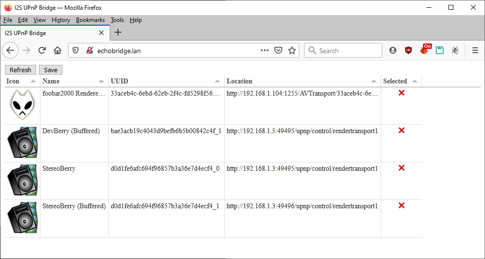
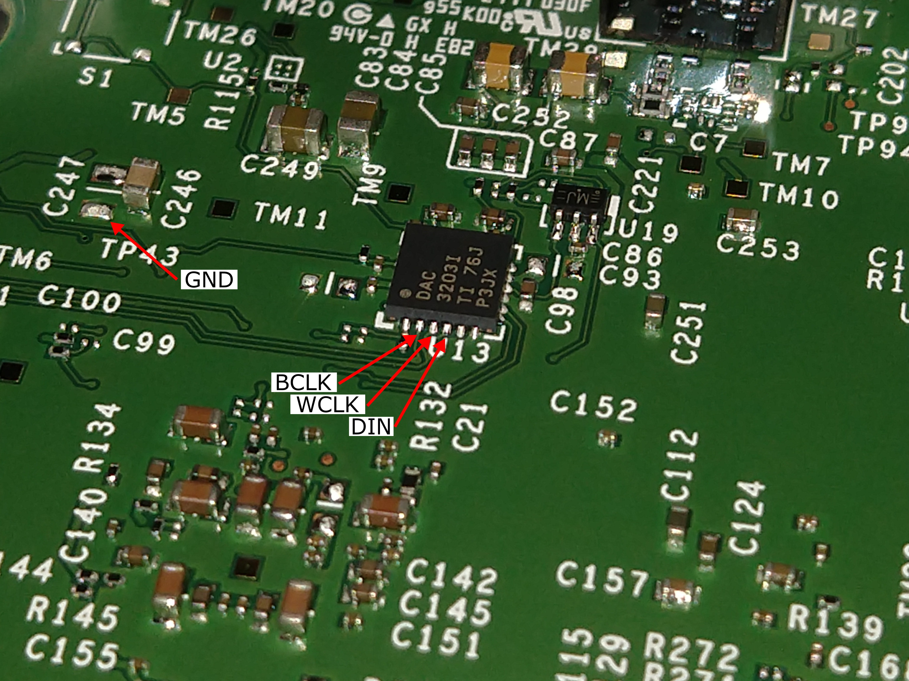
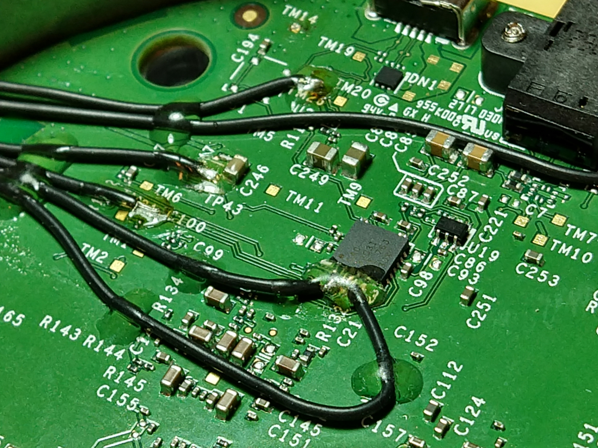
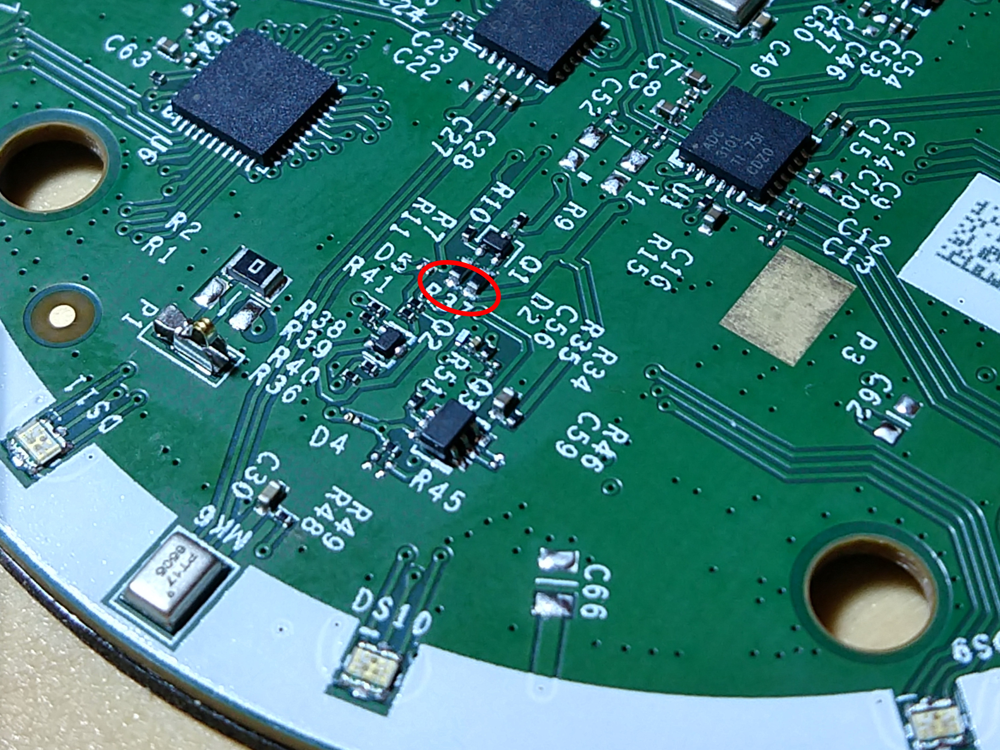
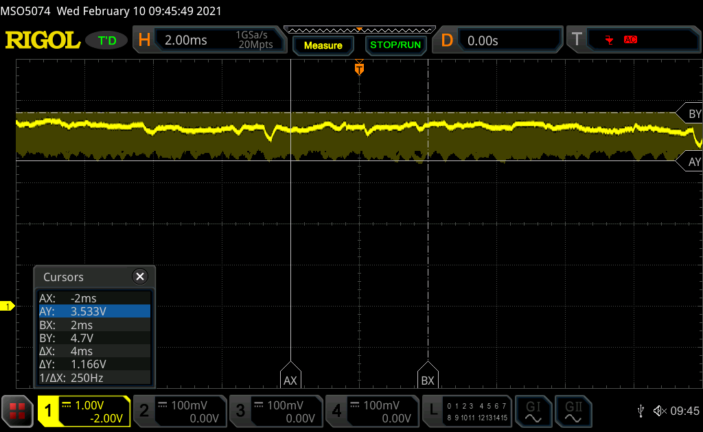
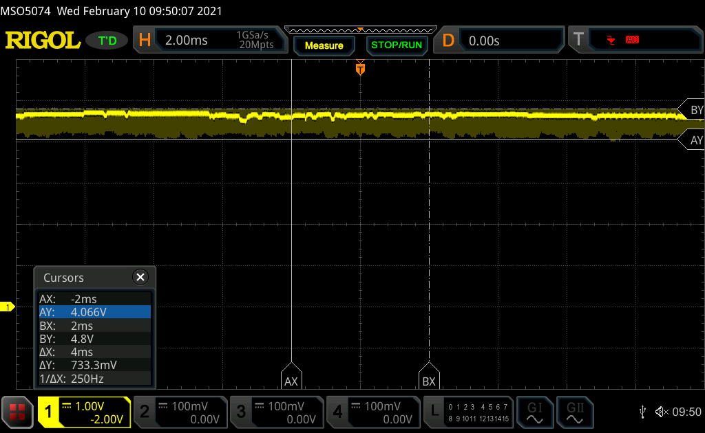
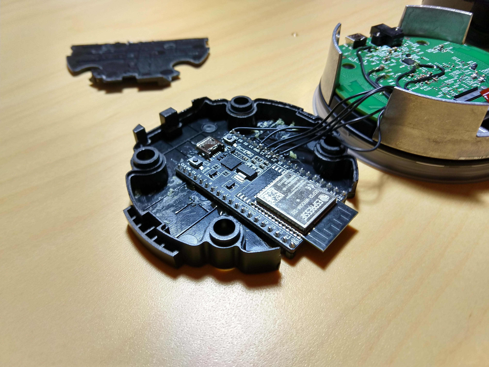
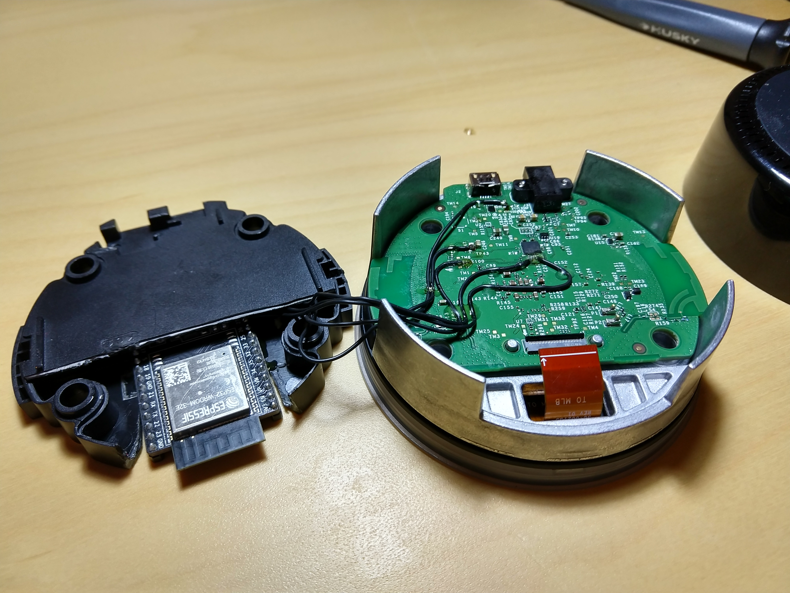

# I2S UPnP Bridge
Sniff audio from an I2S bus and stream it over HTTP with an ESP32. Audio samples are available as WAV and raw `audio/L16` streams via HTTP. Playback on selected UPnP renderers is automatically started when audio activity is detected.

## Manual Streaming
The audio streams are available at the following endpoints:
* `http://your-device-ip-address/stream.wav`
* `http://your-device-ip-address/stream.pcm`

The WAV stream is preferred as support for the `audio/L16` MIME type is finicky.

## Selecting Renderers
A simple web interface is provided to select renderers for automatic control. Renderers on the network are detected via SSDP. All selected renderers automatically begin playback when activity is detected, and stop when activity halts.

The web interface can be found at `http://your-device-ip-address`

## Echo Dot Integration
The real motivation behind this project was to find a way to stream Amazon Music via a Raspberry Pi + DAC HAT I already had. Unfortunately, it seems that neither Amazon, nor Google, are interested in making their protocols freely available.

Based on other's work, I knew it was possible to get audio data from an Echo Dot by sniffing the I2S bus on it's way to the DAC.
* [Hi-Fi Digital Audio from the Echo Dot](https://hackaday.io/project/28109-hi-fi-digital-audio-from-the-echo-dot)
* [S/PDIF from Echo Dot](https://hackaday.io/project/162309-spdif-from-echo-dot)

Similarly it is possible on a Google Home Mini, but with some caveats. e.g. not stereo, probably fixed DSP.
* [Google Home Headphone Jack](https://blog.usedbytes.com/2019/06/google-home-headphone-jack/)

### I2S Wiring
The Echo Dot uses a TI TLV320DAC3203 to convert digital audio to an analog for it's internal speaker and headphone jack. Using the data sheet its trivia to identify which traces on the PCB carry I2S data.

I made solder points by scraping soldermask away.

With a steady hand, solder, and some luck, I wired the following signals on the Echo Dot PCB to the ESP32.
* WCLK - GPIO26
* BCLK - GPIO14
* DIN - GPIO27
* GND - Ground

The wires were secured to the board using UV glue to provide strain relief. The additional 2 wires were for additional experiments and can be ignored.

### Disabling DSP
The Echo Dot uses a large amount of DSP to improve the internal speaker sound. It also mixes down to mono. This is disabled when the headphone jack is inserted. Compare these two clips to see for yourself:
* [DSP on](docs/dsp_on.wav)
* [DSP off](docs/dsp_off.wav)

For this application we need the DSP disabled. The solution is to insert a headphone plug or other substitute into the jack to actuate the internal switches. I used a Q-tip with a small amount of heatshrink to get a snug fit.

### Disabling The Microphones
The easiest method to permanently disable the Echo Dot's mics is to simply leave the LED & microphone board disconnected. However, the LEDs do provide feedback that the device is running and the buttons can be used to control the volume if desired.

Another method is internally disable the power supply to the mics. This method effectively tricks the device into thinking the mute button was pressed. This can be done by soldering the two circled pads together. In this circuit Q1 is a high-side switch providing power to the mics, by shorting the gate to the source the switch is forced off.

A nice little side effect of this approach is the two red LEDs next to the mute buttons are enabled.

### Power Integrity
A good power supply is important. I experienced occasional stutters and dropouts due to a poor power supply. As seen in the scope captures, the first power supply would droop down to 3.5 V, while the second (better) supply stays above 4.0 V.
#### Bad Power Supply

#### Better Power Supply

### Physical Assembly
As I had no use for the internal speaker I gutted it's cavity and installed an ESP32 Dev Kit C into the space. After cutting down the pins the entire design fits back in the original enclosure for a nice clean solution. 

